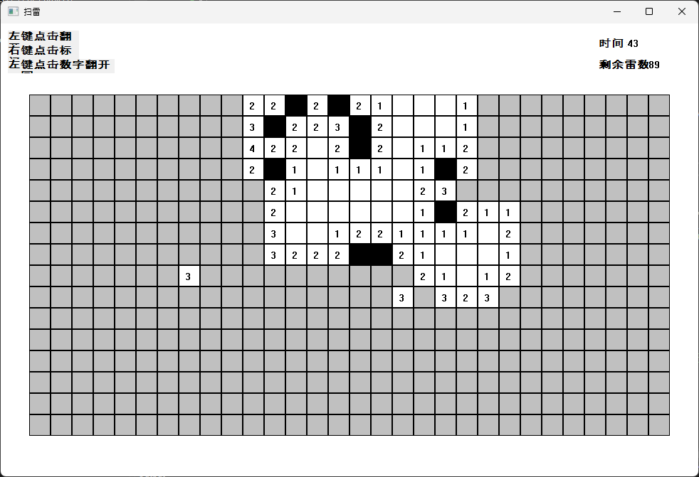

A simple minesweeping game based on CPP and Win32 API. 

GUI is implemented with WIN32 API. GUI design references the traditional windows minesweeping game.

A text file based simple ranking learder board is implemented with linked list. The ranking data is saved in the 'RankingList.txt' file which will be created or read in the same path with the executable file by default.

Different from traditional minesweeping game, this game will generate some *item block* by random. After clicking, an expendable item will become usable and it can be consumed and resume the game after clicking onto the mine.

TODO:
- code refactoring: OOP code logic.

